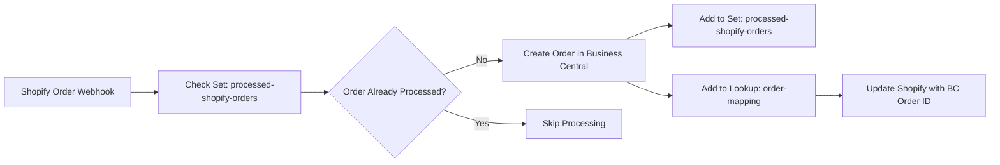
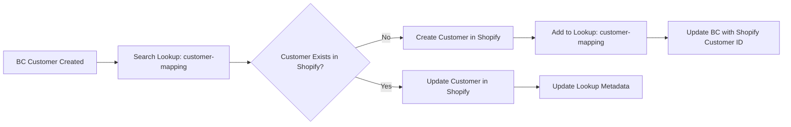
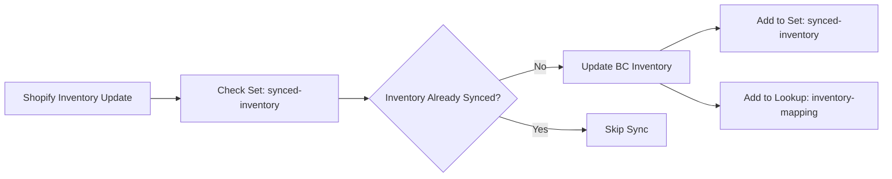
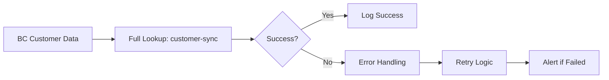
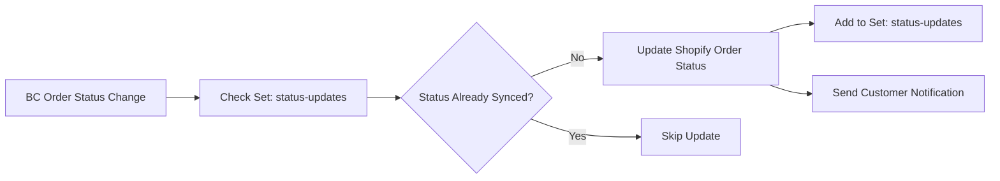

# Stratagems n8n Nodes

A comprehensive set of n8n community nodes that integrate with the **Stratagems Automation Tools** API. These nodes provide easy access to set tracking, lookup mapping, and app management functionality directly within n8n workflows.

## 🎯 **Overview**

The Stratagems n8n nodes enable you to build **reliable**, **idempotent**, and **traceable** automations by providing:

- **🔍 Set Tracking** - Prevent duplicate processing of items
- **🔗 Lookup Mapping** - Map IDs between different systems (ERP, CRM, Shopify, etc.)
- **⚙️ App Management** - Monitor API health and manage application settings
- **🔄 Full Workflow Tracking** - Combined operations for complete automation tracking

Perfect for workflows involving data synchronization, order processing, customer management, and any scenario requiring duplicate prevention and cross-system ID mapping.

---

## 📦 **Available Nodes**

### **1. Stratagems Set Tracker**
Track unique values to prevent duplicate processing in workflows.

**Operations:**
- `checkSetValues` - Check if values exist in a set
- `addToSet` - Add values to a set to mark them as processed

### **2. Stratagems Lookup Mapper**
Create and manage bidirectional ID mappings between different systems.

**Operations:**
- `addToLookup` - Add ID mappings with optional metadata
- `searchLookup` - Search for ID mappings
- `fullLookup` - Add to lookup AND automatically track in a set

### **3. Stratagems App Manager**
Manage application settings and monitor API health.

**Operations:**
- `getAppInfo` - Retrieve current application information
- `healthCheck` - Check API health and connectivity

---

## 🔐 **Authentication & Credentials**

### **StratagemsApi Credentials**
All nodes require authentication using the **StratagemsApi** credentials:

- **Host URL**: Base URL of your Stratagems API instance (e.g., `https://api.yourdomain.com`)
- **API Key**: Your application's API key (starts with `st_`)
- **Authentication Method**: `X-API-Key` header

---

## 📋 **Detailed Node Documentation**

### **Node 1: Stratagems Set Tracker**

#### **Check Set Values Operation**
**Purpose**: Check if values exist in a set and optionally filter results.

**Parameters:**
- **Set Name** (required): Unique name of the set to check
- **Mode**: 
  - `single` - Check one value per item
  - `bulk` - Check multiple values per item
- **Value Field**: Field name containing the value to check (default: `value`)
- **Output Field**: Field name for the result (default: `exists`)
- **Filter Mode**:
  - `all` - Return all items with existence status
  - `existing` - Return only items that exist in set
  - `nonExisting` - Return only items that don't exist in set
- **Create Set If Missing**: 
  - `true` - Automatically create set if it doesn't exist
  - `false` - Throw error if set doesn't exist (default)

**Input Example:**
```json
{
  "orderId": "ORD-12345",
  "customerEmail": "john@example.com"
}
```

**Output Example** (all mode):
```json
{
  "orderId": "ORD-12345",
  "customerEmail": "john@example.com",
  "exists": true,
  "checkedValue": "ORD-12345"
}
```

#### **Add to Set Operation**
**Purpose**: Add values to a set to mark them as processed.

**Parameters:**
- **Set Name** (required): Unique name of the set
- **Mode**:
  - `single` - Add one value per item
  - `bulk` - Add multiple values per item
- **Value Field**: Field name containing the value to add (default: `value`)
- **Metadata Fields**: JSON object with metadata fields to include
- **Create Set If Missing**:
  - `true` - Automatically create set if it doesn't exist
  - `false` - Throw error if set doesn't exist (default)

**Input Example:**
```json
{
  "orderId": "ORD-12345",
  "processedAt": "2024-01-01T10:00:00Z",
  "status": "completed"
}
```

**Output Example:**
```json
{
  "orderId": "ORD-12345",
  "processedAt": "2024-01-01T10:00:00Z",
  "status": "completed",
  "addedToSet": true,
  "setValue": "ORD-12345"
}
```

### **Node 2: Stratagems Lookup Mapper**

#### **Add to Lookup Operation**
**Purpose**: Add ID mappings to a lookup with optional metadata.

**Parameters:**
- **Lookup Name** (required): Unique name of the lookup
- **Mode**:
  - `single` - Add one mapping per item
  - `bulk` - Add multiple mappings per item
- **Left Field**: Field name containing the left system ID (default: `left`)
- **Right Field**: Field name containing the right system ID (default: `right`)
- **Left Metadata Fields**: JSON object with left system metadata
- **Right Metadata Fields**: JSON object with right system metadata
- **Create Lookup If Missing**:
  - `true` - Automatically create lookup if it doesn't exist
  - `false` - Throw error if lookup doesn't exist (default)

**Input Example:**
```json
{
  "shopifyCustomerId": "12345",
  "erpCustomerId": "ERP-67890",
  "customerName": "John Doe",
  "customerEmail": "john@example.com"
}
```

**Output Example:**
```json
{
  "shopifyCustomerId": "12345",
  "erpCustomerId": "ERP-67890",
  "customerName": "John Doe",
  "customerEmail": "john@example.com",
  "mappingAdded": true,
  "leftValue": "12345",
  "rightValue": "ERP-67890"
}
```

#### **Search Lookup Operation**
**Purpose**: Search for ID mappings in a lookup.

**Parameters:**
- **Lookup Name** (required): Unique name of the lookup
- **Search Type**:
  - `left` - Search by left system ID
  - `right` - Search by right system ID
  - `both` - Search by both (returns all mappings)
- **Search Field**: Field name containing the search value (default: `searchValue`)
- **Limit**: Maximum number of results (default: 50, max: 100)
- **Create Lookup If Missing**:
  - `true` - Automatically create lookup if it doesn't exist
  - `false` - Throw error if lookup doesn't exist (default)

**Input Example:**
```json
{
  "searchValue": "12345"
}
```

**Output Example:**
```json
{
  "searchValue": "12345",
  "results": [
    {
      "left": "12345",
      "right": "ERP-67890",
      "leftMetadata": { "name": "John Doe" },
      "rightMetadata": { "email": "john@example.com" }
    }
  ],
  "totalFound": 1
}
```

#### **Full Lookup with Set Tracking Operation**
**Purpose**: Add to lookup AND automatically track in a set (for complete workflow tracking).

**Parameters:**
- **Lookup Name** (required): Unique name of the lookup
- **Set Name** (required): Unique name of the set for tracking
- **Mode**:
  - `single` - Process one mapping per item
  - `bulk` - Process multiple mappings per item
- **Left Field**: Field name containing the left system ID (default: `left`)
- **Right Field**: Field name containing the right system ID (default: `right`)
- **Set Value Field**: Which field to use for set tracking (`left`, `right`, or custom field)
- **Left Metadata Fields**: JSON object with left system metadata
- **Right Metadata Fields**: JSON object with right system metadata
- **Create Lookup If Missing**: Auto-create lookup if missing
- **Create Set If Missing**: Auto-create set if missing

**Input Example:**
```json
{
  "shopifyOrderId": "ORD-12345",
  "erpOrderId": "ERP-67890",
  "orderAmount": 99.99
}
```

**Output Example:**
```json
{
  "shopifyOrderId": "ORD-12345",
  "erpOrderId": "ERP-67890",
  "orderAmount": 99.99,
  "mappingAdded": true,
  "setTrackingAdded": true,
  "trackedValue": "ORD-12345"
}
```

### **Node 3: Stratagems App Manager**

#### **Get App Info Operation**
**Purpose**: Retrieve current application information.

**Parameters**: None required

**Output Example:**
```json
{
  "appInfo": {
    "id": "app-123",
    "name": "My Integration App",
    "description": "App for syncing data",
    "isActive": true,
    "createdAt": "2024-01-01T00:00:00Z"
  }
}
```

#### **Health Check Operation**
**Purpose**: Check API health and connectivity.

**Parameters**: None required

**Output Example:**
```json
{
  "health": {
    "status": "healthy",
    "timestamp": "2024-01-01T10:00:00Z",
    "version": "1.0.0"
  }
}
```

---

## 🔧 **Advanced Configuration Options**

### **Global Settings (All Nodes)**

#### **Error Handling**
- **Retry on Failure**: Number of retry attempts (default: 3)
- **Retry Delay**: Delay between retries in milliseconds (default: 1000)
- **Continue on Error**: Continue processing other items if one fails (default: false)

#### **Performance**
- **Batch Size**: Number of items to process in parallel (default: 10)
- **Timeout**: Request timeout in milliseconds (default: 30000)

#### **Logging**
- **Log Level**: Debug, Info, Warning, Error (default: Info)
- **Include Request/Response**: Log full API requests and responses (default: false)

---

## 📊 **Use Case Examples**

### **Example 1: Shopify → Business Central Order Sync**


**Workflow Steps:**
1. **Shopify webhook** triggers when new order is created
2. **Check Set** - Verify order hasn't been processed before
3. **Create in Business Central** - Create sales order in BC
4. **Add to Set** - Mark order as processed to prevent duplicates
5. **Add to Lookup** - Map Shopify order ID to BC order number
6. **Update Shopify** - Store BC order number in Shopify for reference

**Node Configuration:**
- **Set Name**: `processed-shopify-orders`
- **Lookup Name**: `shopify-bc-order-mapping`
- **Value Field**: `{{$json.id}}` (Shopify order ID)
- **Left Field**: `{{$json.id}}` (Shopify order ID)
- **Right Field**: `{{$json.bcOrderNumber}}` (Business Central order number)

### **Example 2: Business Central → Shopify Customer Sync**


**Workflow Steps:**
1. **Business Central trigger** detects new customer creation
2. **Search Lookup** - Check if customer already exists in Shopify
3. **Create/Update in Shopify** - Sync customer data
4. **Add to Lookup** - Map BC customer number to Shopify customer ID
5. **Update BC** - Store Shopify customer ID in BC for future reference

**Node Configuration:**
- **Lookup Name**: `bc-shopify-customer-mapping`
- **Search Type**: `left` (search by BC customer number)
- **Left Field**: `{{$json.customerNumber}}` (BC customer number)
- **Right Field**: `{{$json.shopifyCustomerId}}` (Shopify customer ID)
- **Metadata**: Include customer name, email, phone for reference

### **Example 3: Inventory Sync with Duplicate Prevention**


**Workflow Steps:**
1. **Shopify inventory webhook** triggers on stock level change
2. **Check Set** - Ensure this inventory update hasn't been processed
3. **Update Business Central** - Sync inventory levels
4. **Add to Set** - Mark as processed to prevent duplicate syncs
5. **Add to Lookup** - Map Shopify product ID to BC item number

**Node Configuration:**
- **Set Name**: `synced-inventory`
- **Lookup Name**: `shopify-bc-inventory-mapping`
- **Value Field**: `{{$json.productId}}_{{$json.locationId}}` (unique inventory key)
- **Metadata**: Include timestamp, quantity, location for audit trail

### **Example 4: Full Customer Sync with Error Handling**


**Workflow Steps:**
1. **Business Central** provides customer data
2. **Full Lookup** - Creates mapping AND tracks in set simultaneously
3. **Error Handling** - Retry failed operations
4. **Logging** - Track all sync activities
5. **Alerts** - Notify on persistent failures

**Node Configuration:**
- **Lookup Name**: `bc-shopify-customer-mapping`
- **Set Name**: `synced-customers`
- **Set Value Field**: `left` (use BC customer number for tracking)
- **Auto-create**: Both lookup and set if missing
- **Metadata**: Include sync timestamp, source system, status

### **Example 5: Order Status Sync with Business Logic**


**Workflow Steps:**
1. **Business Central** order status changes (e.g., "Shipped")
2. **Check Set** - Prevent duplicate status updates
3. **Update Shopify** - Sync status to Shopify order
4. **Add to Set** - Mark status update as processed
5. **Customer Notification** - Send email/SMS to customer

**Node Configuration:**
- **Set Name**: `status-updates`
- **Value Field**: `{{$json.orderNumber}}_{{$json.status}}` (unique status update key)
- **Metadata**: Include timestamp, previous status, new status
- **Filter Mode**: `nonExisting` (only process new status changes)

---

## 🚀 **Installation**

1. **Clone this repository**
   ```bash
   git clone https://github.com/your-org/n8n-nodes-stratagems.git
   cd n8n-nodes-stratagems
   ```

2. **Install dependencies**
   ```bash
   npm install
   ```

3. **Build the nodes**
   ```bash
   npm run build
   ```

4. **Copy the `dist` folder to your n8n custom nodes directory**
   ```bash
   cp -r dist /path/to/n8n/custom/nodes/
   ```

5. **Restart n8n**

---

## 🛠️ **Development**

### **Available Scripts**
- `npm run build` - Build for production
- `npm run dev` - Start development mode with watch
- `npm run lint` - Run linter
- `npm run format` - Format code

### **Project Structure**
```
n8n-node/
├── nodes/
│   ├── BasicProcessor/          # (existing sample)
│   ├── StratagemsSet/          # Set tracking operations
│   ├── StratagemsLookup/       # Lookup mapping operations
│   └── StratagemsApp/          # App management operations
├── credentials/
│   └── StratagemsApi.ts        # API authentication
└── docs/
    ├── StratagemsSet.md        # Set node documentation
    ├── StratagemsLookup.md     # Lookup node documentation
    └── StratagemsApp.md        # App node documentation
```

---

## 📝 **Technical Specifications**

### **API Endpoints Used**
- `GET /api/v1/sets/:set/contains` - Check set values
- `POST /api/v1/sets/:set/values` - Add to set
- `POST /api/v1/sets/:set/values/bulk` - Bulk add to set
- `POST /api/v1/sets/:set/contains/bulk` - Bulk check set values
- `POST /api/v1/lookups/:lookup/values` - Add to lookup
- `POST /api/v1/lookups/:lookup/values/bulk` - Bulk add to lookup
- `GET /api/v1/lookups/:lookup/search` - Search lookup
- `POST /api/v1/sets` - Create set
- `POST /api/v1/lookups` - Create lookup
- `GET /api/v1/apps/me` - Get app info
- `GET /api/v1/apps/health` - Health check

### **Data Validation**
- Set names: Alphanumeric, hyphens, underscores only
- Values: Max 255 characters
- Metadata: JSON objects
- Bulk operations: Max 1000 items per request

### **Error Codes**

#### **Authentication Errors**
- `MISSING_API_KEY` - No API key provided in request headers
- `INVALID_API_KEY` - Provided API key is not valid
- `INACTIVE_API_KEY` - API key exists but is marked as inactive
- `EXPIRED_API_KEY` - API key has passed its expiration date
- `AUTH_ERROR` - General authentication/authorization error

#### **Set Operation Errors**
- `SET_NOT_FOUND` - Specified set doesn't exist
- `DUPLICATE_SET` - Set with the same name already exists
- `SET_VALUE_TOO_LONG` - Value exceeds maximum length (255 characters)
- `SET_NAME_INVALID` - Set name contains invalid characters (only alphanumeric, hyphens, underscores allowed)
- `SET_DESCRIPTION_TOO_LONG` - Set description exceeds maximum length (500 characters)
- `SET_VALUE_REQUIRED` - Value field is required but not provided
- `SET_BULK_LIMIT_EXCEEDED` - Bulk operation exceeds maximum limit (1000 items)
- `SET_EMPTY_BULK_REQUEST` - Bulk operation contains no values
- `SET_VALUE_ID_NOT_FOUND` - Specified value ID doesn't exist in the set
- `SET_STRICT_CHECKING_VIOLATION` - Strict checking enabled but validation failed

#### **Lookup Operation Errors**
- `LOOKUP_NOT_FOUND` - Specified lookup doesn't exist
- `DUPLICATE_LOOKUP` - Lookup with the same name already exists
- `LOOKUP_NAME_INVALID` - Lookup name contains invalid characters
- `LOOKUP_DESCRIPTION_TOO_LONG` - Lookup description exceeds maximum length
- `LOOKUP_LEFT_VALUE_REQUIRED` - Left value is required but not provided
- `LOOKUP_RIGHT_VALUE_REQUIRED` - Right value is required but not provided
- `LOOKUP_LEFT_VALUE_TOO_LONG` - Left value exceeds maximum length
- `LOOKUP_RIGHT_VALUE_TOO_LONG` - Right value exceeds maximum length
- `LOOKUP_BULK_LIMIT_EXCEEDED` - Bulk operation exceeds maximum limit (1000 items)
- `LOOKUP_EMPTY_BULK_REQUEST` - Bulk operation contains no values
- `LOOKUP_VALUE_ID_NOT_FOUND` - Specified value ID doesn't exist in the lookup
- `LOOKUP_DUPLICATE_LEFT_RIGHT_PAIR` - Left-right pair already exists (when duplicates not allowed)
- `LOOKUP_DUPLICATE_LEFT_VALUE` - Left value already exists (when duplicates not allowed)
- `LOOKUP_DUPLICATE_RIGHT_VALUE` - Right value already exists (when duplicates not allowed)
- `LOOKUP_STRICT_CHECKING_VIOLATION` - Strict checking enabled but validation failed
- `LOOKUP_SEARCH_PARAMETERS_INVALID` - Invalid search parameters provided
- `LOOKUP_SEARCH_LIMIT_EXCEEDED` - Search limit exceeds maximum (100 items)

#### **App Management Errors**
- `APP_NOT_FOUND` - Specified app doesn't exist
- `DUPLICATE_APP` - App with the same name already exists
- `APP_NAME_INVALID` - App name contains invalid characters
- `APP_DESCRIPTION_TOO_LONG` - App description exceeds maximum length
- `APP_INACTIVE` - App is marked as inactive
- `APP_PERMISSION_DENIED` - App doesn't have required permissions
- `APP_API_KEY_GENERATION_FAILED` - Failed to generate new API key
- `APP_UPDATE_FAILED` - Failed to update app information
- `APP_DELETE_FAILED` - Failed to delete app

#### **Validation Errors**
- `VALIDATION_ERROR` - General validation error
- `REQUIRED_FIELD_MISSING` - Required field is missing from request
- `FIELD_TYPE_INVALID` - Field contains invalid data type
- `FIELD_LENGTH_EXCEEDED` - Field value exceeds maximum length
- `FIELD_FORMAT_INVALID` - Field value has invalid format
- `JSON_PARSE_ERROR` - Invalid JSON in request body
- `QUERY_PARAMETER_INVALID` - Invalid query parameter value
- `PATH_PARAMETER_INVALID` - Invalid path parameter value

#### **Network & Infrastructure Errors**
- `CONNECTION_TIMEOUT` - Request timed out
- `CONNECTION_REFUSED` - Unable to connect to server
- `DNS_RESOLUTION_FAILED` - Failed to resolve hostname
- `SSL_CERTIFICATE_ERROR` - SSL certificate validation failed
- `RATE_LIMIT_EXCEEDED` - Too many requests in time window
- `SERVICE_UNAVAILABLE` - Service temporarily unavailable
- `GATEWAY_TIMEOUT` - Upstream service timeout
- `BAD_GATEWAY` - Invalid response from upstream service

#### **Database & Storage Errors**
- `DATABASE_CONNECTION_ERROR` - Unable to connect to database
- `DATABASE_QUERY_ERROR` - Database query failed
- `DATABASE_TRANSACTION_ERROR` - Database transaction failed
- `STORAGE_FULL` - Storage quota exceeded
- `DATA_CORRUPTION` - Data integrity check failed
- `BACKUP_RESTORE_ERROR` - Backup/restore operation failed

#### **Business Logic Errors**
- `RESOURCE_LOCKED` - Resource is currently locked by another process
- `CONCURRENT_MODIFICATION` - Resource was modified by another request
- `BUSINESS_RULE_VIOLATION` - Operation violates business rules
- `WORKFLOW_STATE_INVALID` - Invalid workflow state for operation
- `DEPENDENCY_MISSING` - Required dependency not available
- `CONFIGURATION_ERROR` - Invalid configuration detected

#### **n8n Node Specific Errors**
- `NODE_CONFIGURATION_ERROR` - Invalid node configuration
- `CREDENTIALS_MISSING` - Required credentials not configured
- `CREDENTIALS_INVALID` - Invalid credentials format
- `INPUT_DATA_INVALID` - Invalid input data format
- `OUTPUT_FIELD_MISSING` - Required output field not found
- `BULK_OPERATION_FAILED` - Bulk operation partially failed
- `RETRY_LIMIT_EXCEEDED` - Maximum retry attempts reached
- `NODE_EXECUTION_TIMEOUT` - Node execution timed out
- `WORKFLOW_CONTEXT_ERROR` - Error accessing workflow context
- `EXPRESSION_EVALUATION_ERROR` - Error evaluating n8n expression

#### **General System Errors**
- `INTERNAL_ERROR` - Unexpected internal server error
- `NOT_IMPLEMENTED` - Requested feature not implemented
- `MAINTENANCE_MODE` - System is in maintenance mode
- `VERSION_DEPRECATED` - API version is deprecated
- `UPGRADE_REQUIRED` - Client upgrade required
- `FEATURE_DISABLED` - Requested feature is disabled
- `QUOTA_EXCEEDED` - Usage quota exceeded
- `LICENSE_EXPIRED` - License has expired
- `SYSTEM_OVERLOAD` - System is overloaded
- `EMERGENCY_MODE` - System is in emergency mode

---

## 🤝 **Contributing**

1. Fork the repository
2. Create a feature branch (`git checkout -b feature/amazing-feature`)
3. Commit your changes (`git commit -m 'Add amazing feature'`)
4. Push to the branch (`git push origin feature/amazing-feature`)
5. Open a Pull Request

### **Development Guidelines**
- Follow TypeScript best practices
- Write tests for new features
- Update documentation as needed
- Use conventional commit messages

---

## 📄 **License**

This project is licensed under the MIT License - see the [LICENSE](LICENSE) file for details.

---

## 🆘 **Support**

- 📖 [Stratagems API Documentation](https://github.com/your-org/st-open-source)
- 🐛 [Issues](https://github.com/your-org/n8n-nodes-stratagems/issues)
- 💬 [Discussions](https://github.com/your-org/n8n-nodes-stratagems/discussions)

---

## 🙏 **Acknowledgments**

- Built for [n8n](https://n8n.io/) - The most powerful workflow automation tool
- Integrates with [Stratagems Automation Tools](https://github.com/your-org/st-open-source)
- Powered by Node.js and TypeScript 