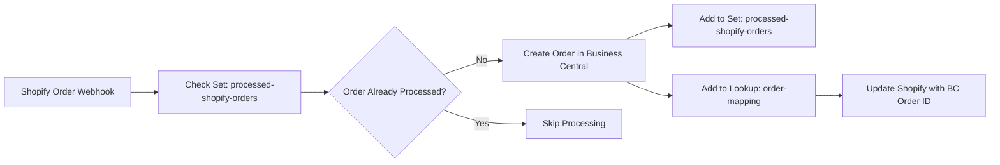
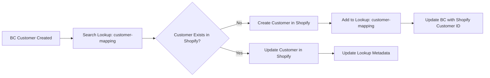
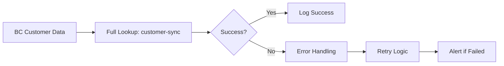

# 8kit n8n Nodes

A comprehensive n8n community node that integrates with the **8kit Automation Tools** API. This node provides easy access to set tracking, lookup mapping, and app management functionality directly within n8n workflows.

## 🎯 **Overview**

The 8kit node enables you to build **reliable**, **idempotent**, and **traceable** automations by providing:

- **🔍 Set Tracking** - Prevent duplicate processing of items
- **🔗 Lookup Mapping** - Map IDs between different systems (ERP, CRM, Shopify, etc.)
- **⚙️ App Management** - Monitor API health and manage application settings
- **🔄 Full Workflow Tracking** - Combined operations for complete automation tracking

Perfect for workflows involving data synchronization, order processing, customer management, and any scenario requiring duplicate prevention and cross-system ID mapping.

---

## 📦 **Available Operations**

The **8kit** node provides the following operations:

### **Set Operations**
- `checkSetValues` - Check if values exist in a set
- `addToSet` - Add values to a set to mark them as processed

### **Lookup Operations**
- `addToLookup` - Add ID mappings to a lookup with optional metadata
- `searchLookup` - Search for ID mappings in a lookup
- `fullLookup` - Add to lookup AND automatically track in a set

### **App Operations**
- `getAppInfo` - Retrieve current application information
- `healthCheck` - Check API health and connectivity

---

## 🔐 **Authentication & Credentials**

### **8kitApi Credentials**
The node requires authentication using the **8kitApi** credentials:

- **Host URL**: Base URL of your 8kit API instance (e.g., `https://api.yourdomain.com`)
- **API Key**: Your application's API key (starts with `st_`)
- **Authentication Method**: `X-API-Key` header

---

## 📋 **Detailed Operation Documentation**

### **Set Operations**

#### **Check Set Values Operation**
**Purpose**: Check if values exist in a set and optionally filter results.

**Parameters:**
- **Set Name** (required): Unique name of the set to check
- **Value Field**: Field name containing the value to check (default: `value`)
- **Filter Mode**:
  - `all` - Return all items with existence status
  - `existing` - Return only items that exist in set
  - `nonExisting` - Return only items that don't exist in set
- **Get Set Value Data**: Include set value data in the output
- **Set Value Data Field Name**: Field name to store the set value data
- **Auto Create Set/Lookup**: 
  - `true` - Automatically create set if it doesn't exist
  - `false` - Throw error if set doesn't exist (default)

**Input Example:**
```json
{
  "orderId": "ORD-12345",
  "customerEmail": "john@example.com"
}
```

**Output Example**:
```json
{
  "success": true,
  "exists": true,
  "value": "ORD-12345",
  "setValue": {
    "id": "set-value-123",
    "setId": "set-abc",
    "value": "ORD-12345",
    "metadata": {
      "processedAt": "2024-01-01T10:00:00Z"
    },
    "createdAt": "2024-01-01T10:00:00Z",
    "updatedAt": "2024-01-01T10:00:00Z"
  }
}
```

#### **Add to Set Operation**
**Purpose**: Add values to a set to mark them as processed.

**Parameters:**
- **Set Name** (required): Unique name of the set
- **Value Field**: Field name containing the value to add (default: `value`)
- **Metadata Fields**: Comma-separated list of fields to include as metadata
- **Auto Create Set/Lookup**:
  - `true` - Automatically create set if it doesn't exist
  - `false` - Throw error if set doesn't exist (default)

**Input Example:**
```json
{
  "orderId": "ORD-12345",
  "processedAt": "2024-01-01T10:00:00Z",
  "status": "completed"
}
```

**Output Example:**
```json
{
  "success": true,
  "data": {
    "id": "set-value-123",
    "setId": "set-abc",
    "value": "ORD-12345",
    "metadata": {
      "processedAt": "2024-01-01T10:00:00Z",
      "status": "completed"
    },
    "createdAt": "2024-01-01T10:00:00Z",
    "updatedAt": "2024-01-01T10:00:00Z"
  }
}
```

### **Lookup Operations**

#### **Add to Lookup Operation**
**Purpose**: Add ID mappings to a lookup with optional metadata.

**Parameters:**
- **Lookup Name** (required): Unique name of the lookup
- **Left Field**: Field name containing the left system ID (default: `left`)
- **Right Field**: Field name containing the right system ID (default: `right`)
- **Left Metadata Fields**: Comma-separated list of fields to include as left metadata
- **Right Metadata Fields**: Comma-separated list of fields to include as right metadata
- **Auto Create Set/Lookup**:
  - `true` - Automatically create lookup if it doesn't exist
  - `false` - Throw error if lookup doesn't exist (default)

**Input Example:**
```json
{
  "shopifyCustomerId": "12345",
  "erpCustomerId": "ERP-67890",
  "customerName": "John Doe",
  "customerEmail": "john@example.com"
}
```

**Output Example:**
```json
{
  "success": true,
  "data": {
    "id": "lookup-value-123",
    "lookupId": "lookup-abc",
    "left": "12345",
    "right": "ERP-67890",
    "leftMetadata": {
      "customerName": "John Doe"
    },
    "rightMetadata": {
      "customerEmail": "john@example.com"
    },
    "createdAt": "2024-01-01T10:00:00Z",
    "updatedAt": "2024-01-01T10:00:00Z"
  }
}
```

#### **Search Lookup Operation**
**Purpose**: Search for ID mappings in a lookup.

**Parameters:**
- **Lookup Name** (required): Unique name of the lookup
- **Search Type**:
  - `left` - Search by left system ID
  - `right` - Search by right system ID
  - `both` - Search by both (returns all mappings)
- **Search Value**: The actual value to search for
- **Auto Create Set/Lookup**:
  - `true` - Automatically create lookup if it doesn't exist
  - `false` - Throw error if lookup doesn't exist (default)

**Input/Output Example:**
```json
{
  "success": true,
  "results": [
    {
      "id": "lookup-value-123",
      "lookupId": "lookup-abc",
      "left": "12345",
      "right": "ERP-67890",
      "leftMetadata": { "name": "John Doe" },
      "rightMetadata": { "email": "john@example.com" },
      "createdAt": "2024-01-01T10:00:00Z",
      "updatedAt": "2024-01-01T10:00:00Z"
    }
  ],
  "total": 1
}
```

#### **Full Lookup with Set Tracking Operation**
**Purpose**: Add to lookup AND automatically track in a set (for complete workflow tracking).

**Parameters:**
- **Lookup Name** (required): Unique name of the lookup
- **Set Name** (required): Unique name of the set for tracking
- **Left Field**: Field name containing the left system ID (default: `left`)
- **Right Field**: Field name containing the right system ID (default: `right`)
- **Left Metadata Fields**: Comma-separated list of fields to include as left metadata
- **Right Metadata Fields**: Comma-separated list of fields to include as right metadata
- **Set Value Field**: Which field to use for set tracking (`left`, `right`, or custom field)
- **Custom Set Value Field**: Custom field name for set tracking (when Set Value Field is 'custom')
- **Auto Create Set/Lookup**: Auto-create lookup and set if missing

**Input Example:**
```json
{
  "shopifyOrderId": "ORD-12345",
  "erpOrderId": "ERP-67890",
  "orderAmount": 99.99
}
```

**Output Example:**
```json
{
  "success": true,
  "lookupResult": {
    "id": "lookup-value-123",
    "lookupId": "lookup-abc",
    "left": "ORD-12345",
    "right": "ERP-67890",
    "leftMetadata": null,
    "rightMetadata": null,
    "createdAt": "2024-01-01T10:00:00Z",
    "updatedAt": "2024-01-01T10:00:00Z"
  },
  "setResult": {
    "id": "set-value-123",
    "setId": "set-abc",
    "value": "ORD-12345",
    "metadata": null,
    "createdAt": "2024-01-01T10:00:00Z",
    "updatedAt": "2024-01-01T10:00:00Z"
  }
}
```

### **App Operations**

#### **Get App Info Operation**
**Purpose**: Retrieve current application information.

**Parameters**: None required

**Output Example:**
```json
{
  "id": "app-123",
  "name": "My Integration App",
  "description": "App for syncing data",
  "isActive": true,
  "createdAt": "2024-01-01T00:00:00Z",
  "updatedAt": "2024-01-01T00:00:00Z"
}
```

#### **Health Check Operation**
**Purpose**: Check API health and connectivity.

**Parameters**: None required

**Output Example:**
```json
{
  "appId": "app-123",
  "appName": "My Integration App",
  "status": "healthy",
  "timestamp": "2024-01-01T10:00:00Z"
}
```

---

## 🔧 **Advanced Configuration**

### **Auto Create Feature**
The **Auto Create Set/Lookup** option allows the node to automatically create sets or lookups if they don't exist, eliminating the need for manual setup. This feature is available for all operations that work with sets or lookups.

### **Mode Options**
Note: Currently, all operations use single mode by default.

### **Field Mapping**
All operations support flexible field mapping, allowing you to specify which fields from your input data should be used for the operation. This makes the node highly adaptable to different data structures.

---

## 📊 **Use Case Examples**

### **Example 1: Shopify → Business Central Order Sync**


**Workflow Steps:**
1. **Shopify webhook** triggers when new order is created
2. **Check Set** - Verify order hasn't been processed before
3. **Create in Business Central** - Create sales order in BC
4. **Add to Set** - Mark order as processed to prevent duplicates
5. **Add to Lookup** - Map Shopify order ID to BC order number
6. **Update Shopify** - Store BC order number in Shopify for reference

**Node Configuration:**
- **Operation**: `checkSetValues`
- **Set Name**: `processed-shopify-orders`
- **Value Field**: `{{$json.id}}` (Shopify order ID)
- **Auto Create Set/Lookup**: `true`

### **Example 2: Business Central → Shopify Customer Sync**


**Workflow Steps:**
1. **Business Central trigger** detects new customer creation
2. **Search Lookup** - Check if customer already exists in Shopify
3. **Create/Update in Shopify** - Sync customer data
4. **Add to Lookup** - Map BC customer number to Shopify customer ID
5. **Update BC** - Store Shopify customer ID in BC for future reference

**Node Configuration:**
- **Operation**: `searchLookup`
- **Lookup Name**: `bc-shopify-customer-mapping`
- **Search Type**: `left` (search by BC customer number)
- **Search Value**: `BC-12345` (BC customer number)
- **Auto Create Set/Lookup**: `true`

### **Example 3: Full Customer Sync with Set Tracking**


**Workflow Steps:**
1. **Business Central** provides customer data
2. **Full Lookup** - Creates mapping AND tracks in set simultaneously
3. **Error Handling** - Retry failed operations
4. **Logging** - Track all sync activities
5. **Alerts** - Notify on persistent failures

**Node Configuration:**
- **Operation**: `fullLookup`
- **Lookup Name**: `bc-shopify-customer-mapping`
- **Set Name**: `synced-customers`
- **Set Value Field**: `left` (use BC customer number for tracking)
- **Auto Create Set/Lookup**: `true`

---

## 🚀 **Installation**

### **Option 1: Docker (Recommended)**

1. **Clone this repository**
   ```bash
   git clone https://github.com/your-org/n8n-nodes-stratagems.git
   cd n8n-nodes-stratagems
   ```

2. **Build the nodes**
   ```bash
   npm run build
   ```

3. **Start n8n with Docker**
   ```bash
   ./start-n8n.sh
   ```

4. **Stop n8n**
   ```bash
   ./stop-n8n.sh
   ```

### **Option 2: Manual Installation**

1. **Clone this repository**
   ```bash
   git clone https://github.com/your-org/n8n-nodes-stratagems.git
   cd n8n-nodes-stratagems
   ```

2. **Install dependencies**
   ```bash
   npm install
   ```

3. **Build the nodes**
   ```bash
   npm run build
   ```

4. **Copy the `dist` folder to your n8n custom nodes directory**
   ```bash
   cp -r dist /path/to/n8n/custom/nodes/
   ```

5. **Restart n8n**

---

## 🛠️ **Development**

### **Available Scripts**
- `npm run build` - Build for production
- `npm run dev` - Start development mode with watch
- `npm run lint` - Run linter
- `npm run format` - Format code

### **Project Structure**
```
n8n-node/
├── nodes/
│   └── StratagemsTool/
│       ├── operations/
│       │   ├── addToLookup.ts
│       │   ├── addToSet.ts
│       │   ├── checkSetValues.ts
│       │   ├── fullLookup.ts
│       │   ├── getAppInfo.ts
│       │   ├── healthCheck.ts
│       │   ├── searchLookup.ts
│       │   └── index.ts
│       ├── utils/
│       │   └── httpClient.ts
│       ├── StratagemsTool.node.ts
│       └── stratagemsTool.svg
├── credentials/
│   └── StratagemsApi.credentials.ts
├── dist/                    # Built files
├── docker-compose.yml       # Docker configuration
├── start-n8n.sh            # Start script
├── stop-n8n.sh             # Stop script
└── package.json
```

### **Architecture**
The node is built with a modular architecture:
- **Main Node**: `StratagemsTool.node.ts` - Handles UI configuration and operation routing
- **Operations**: Individual files for each operation type, imported from `operations/index.ts`
- **Utilities**: Shared HTTP client and helper functions
- **Credentials**: Authentication configuration for the Stratagems API

---

## 📝 **Technical Specifications**

### **API Endpoints Used**
- `POST /api/v1/sets/:set/contains` - Check single set value
- `POST /api/v1/sets/:set/values` - Add to set
- `POST /api/v1/sets/:set/values/bulk` - Bulk add to set
- `POST /api/v1/sets/:set/contains/bulk` - Bulk check set values
- `POST /api/v1/lookups/:lookup/values` - Add to lookup
- `POST /api/v1/lookups/:lookup/values/bulk` - Bulk add to lookup
- `GET /api/v1/lookups/:lookup/search` - Search lookup
- `POST /api/v1/sets` - Create set
- `POST /api/v1/lookups` - Create lookup
- `GET /api/v1/apps/me` - Get app info
- `GET /api/v1/apps/health` - Health check

### **Data Validation**
- Set names: Alphanumeric, hyphens, underscores only
- Values: Max 255 characters
- Metadata: JSON objects
- Bulk operations: Max 1000 items per request

### **Error Handling**
The node includes comprehensive error handling for:
- Authentication failures
- Network connectivity issues
- API rate limiting
- Invalid data formats
- Missing required fields
- Resource not found errors

### **Performance Features**
- **Bulk Operations**: Process multiple items efficiently
- **Auto-retry**: Built-in retry logic for transient failures
- **Connection Pooling**: Reuse HTTP connections for better performance
- **Error Recovery**: Graceful handling of partial failures in bulk operations

---

## 🤝 **Contributing**

1. Fork the repository
2. Create a feature branch (`git checkout -b feature/amazing-feature`)
3. Commit your changes (`git commit -m 'Add amazing feature'`)
4. Push to the branch (`git push origin feature/amazing-feature`)
5. Open a Pull Request

### **Development Guidelines**
- Follow TypeScript best practices
- Write tests for new features
- Update documentation as needed
- Use conventional commit messages
- Maintain modular architecture with separate operation files

---

## 📄 **License**

This project is licensed under the MIT License - see the [LICENSE](LICENSE) file for details.

---

## 🆘 **Support**

- 📖 [Stratagems API Documentation](https://github.com/your-org/st-open-source)
- 🐛 [Issues](https://github.com/your-org/n8n-nodes-stratagems/issues)
- 💬 [Discussions](https://github.com/your-org/n8n-nodes-stratagems/discussions)

---

## 🙏 **Acknowledgments**

- Built for [n8n](https://n8n.io/) - The most powerful workflow automation tool
- Integrates with [Stratagems Automation Tools](https://github.com/your-org/st-open-source)
- Powered by Node.js and TypeScript 